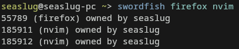
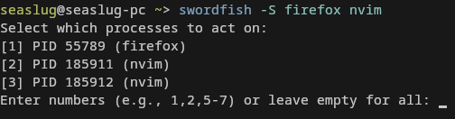

# swordfish
`swordfish` is a pkill-like CLI tool that's feature-rich and written in C. It lets you find and kill processes with ease and cleaner flag syntax.

## Why use this instead of pkill?
- You prefer grouped, pacman-style flags (e.g. `-ky`)
- You want more safety if you kill the wrong process or PID
- You like lightweight, clean, CLI tools.

## Features
- Grouped flags like `-Sky` (inspired by pacman)
- Raw signal support (e.g. `-10`, `-15`)
- Dry run mode to see what would be killed and how
- Lightweight and dependency-free (for now)

###





## Usage Examples

```bash
# Dry run
swordfish -s firefox

# Kill all 'nvim' processes using SIGTERM
swordfish -k nvim

# Kill all 'nvim' and 'firefox' processes without the confirmation
swordfish -ky nvim firefox

# Kill only certain processes selected via user input
swordfish -Sk bash
```

## Installation
From the AUR (using an AUR pkg manager):
```bash
yay -S swordfish-git
```

Or manually:
```bash
git clone https://aur.archlinux.org/swordfish-git.git
cd swordfish-git
makepkg -si
```

## Building From Source
Building from source is pretty easy. All you need is `gcc` and `make` (for now):
```bash
git clone https://github.com/Foox-dev/swordfish
cd swordfish
make
```

## License
MIT

## Contributing
Feel free to contribute. Any help is welcome! Our goal is to create a useful tool for all to use. This is my first thing I've made in C that's actually public (help is greatly appreciated).

Follow all standard etiquette when working with others, yada yada blah blah blah.
